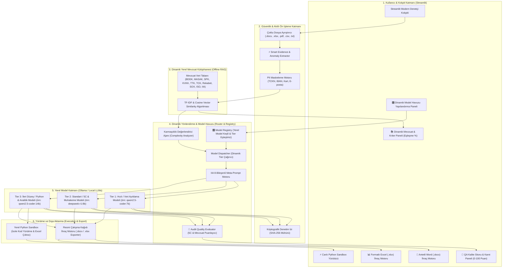

# Local Audit AI — Sistem Mimarisi ve Teknik Şartname (Architecture & Technical Spec)
**Sürüm:** 3.5 (Next-Gen AI Audit OS with Dynamic Multi-Regulatory RAG, Smart Extractor & QA Scorer)  
**Tarih:** Ağustos 2026  
**Metodoloji:** The Institute of Internal Auditors (IIA) "AI Prompting for Internal Auditors" Standardı  
**Güvenlik Sınıfı:** %100 Yerel / Çevrimdışı (Zero Data Leakage / Air-Gapped)

---

## 1. Mimarinin Temel İlkeleri ve Vizyonu

Local Audit AI; iç denetçilerin hassas denetim verilerini, mizanlarını, mülakat tutanaklarını ve kurumsal politika dokümanlarını hiçbir bulut sağlayıcısına veya harici API'ye göndermeden, **%100 yerel bilgisayarda (On-Premise / Edge AI)** analiz eden, IIA standartlarında resmi çalışma kağıtları üreten, Python analitik kodlarını yerel izole ortamda çalıştırıp Excel istisna raporları döken ve çoklu yasal otoritelerin mevzuatlarını dinamik olarak eşleştiren tam teşekküllü bir denetim işletim sistemidir.



---

## 2. Temel Modüller, Fonksiyonlar ve Teknik Yetenekler

### 🎛️ A. Dinamik Model Havuzu ve Otonom Tier Eşleştirme Motoru (Model Registry & Auto-Tiering)
* **Modül:** `core/router/model_registry.py` | **Konfigürasyon:** `config/config.yaml`
* **İşlevi:** Makinede 10, 20 veya 50 yerel model olsa dahi; sistemin bu modellerin uzmanlıklarını (kodlama, akıl yürütme, hafif veri çekme) ve parametre büyüklüklerini otonom olarak analiz edip en ideal Tier 1, Tier 2 ve Tier 3 eşleştirmesini kullanıcı müdahalesiz yapmasını sağlar.

#### 🪄 Otonom Model Analiz ve Puanlama Kriterleri:
1. **Tier 1 (Hafif / Veri Ayıklama Puanı):** Küçük parametreli (3B-8B), hızlı çalışan ve token tüketimi düşük modellere (örn: `qwen2.5:7b`, `mistral:7b`) yüksek puan verir.
2. **Tier 2 (Standart / 5C & Muhakeme Puanı):** Akıl yürütme (`r1`, `reasoning`, `think`, `qwq`) veya 8B-14B talimat modellerine (örn: `deepseek-r1:8b`, `deepseek-r1:14b`, `llama3.1:8b`) yüksek puan verir.
3. **Tier 3 (İleri Düzey / Python & Analitik Puanı):** Kodlama uzmanı (`coder`, `code`, `python`) veya 14B-70B büyük parametreli analitik modellere (örn: `qwen2.5-coder:14b`, `qwen2.5:32b`, `llama3.3:70b`) yüksek puan verir.

#### 🔄 Fonksiyonel Yaşam Döngüsü:
* **Tek Tıkla Otonom Eşleme (`auto_configure_best_tiers`):** Arayüzdeki *"🪄 Otonom En İdeal Modelleri Eşle"* butonuna basıldığında; sistem tüm kurulu modelleri tarar, her model için $0-10$ arası uzmanlık skorları üretir, en yüksek skorlu modelleri ilgili Tier'lara yerleştirir ve `config/config.yaml` dosyasını otomatik olarak günceller.

#### 🔄 Yeni Eklenen Bir Modelin Sisteme Yansıtılma Yaşam Döngüsü (Fonksiyonel Akış):
1. **Modelin İndirilmesi / Kurulması:** Kullanıcı terminalden dilediği yeni modeli yerel Ollama sunucusuna çeker (`ollama run qwen3:14b` vb.).
2. **Otomatik Model Keşfi (`discover_installed_models`):** `ModelRegistry`, yerel Ollama API'sini (`GET http://127.0.0.1:11434/api/tags`) sorgulayarak makinede kurulu tüm modelleri otomatik olarak listeler.
3. **Tier Eşleştirme ve Kayıt (`update_tier_model`):** 
   * Kullanıcı arayüzdeki **`Otomatik Yönlendirme Model Havuzunu Yapılandır`** panelinden veya `config/config.yaml` üzerinden yeni modeli ilgili Tier'a atar:
     * **Tier 1 (Hızlı/Ayıklama):** `qwen3:7b`
     * **Tier 2 (5C & Muhakeme):** `deepseek-r2:14b`
     * **Tier 3 (Analitik/Python & Kodlama):** `qwen3:32b`
   * Değişiklikler anında atomik olarak `config/config.yaml` dosyasına yazılır.
4. **Dinamik Yönlendirme İcrası (`ModelDispatcher.dispatch`):** 
   * Denetçi arayüzden bir görev başlattığında, `ComplexityAnalyzerAgent` görevin karmaşıklığını hesaplar (`tier_1`, `tier_2` veya `tier_3`).
   * `ModelDispatcher`, sabit kodlanmış modeller yerine doğrudan `ModelRegistry.get_tier_models()` fonksiyonunu çağırır ve bu Tier'a yeni atanmış güncel modeli seçer.
5. **Kullanıcı Müdahalesine Gerek Kalmaksızın Yürütme:** Kullanıcı her işlemde tek tek model seçmek zorunda kalmaz; sistem arka planda her görevi yeni yapılandırılan en güçlü modelle otomatik olarak yürütür.

### 📚 A. Dinamik Yerel Mevzuat ve Kriter Bilgi Tabanı Motoru (Dynamic Offline RAG)
* **Modül:** `core/knowledge/rag_engine.py` | **Veritabanı:** `config/regulations_knowledge_base.json`
* **İşlevi:** Denetçinin girdiği vaka verilerini ve belgeleri yerel kütüphanede tarayarak IIA 5C bulgusu için zorunlu olan yasal **"Criteria (Kriter / Hukuki Dayanak)"** maddelerini saniyeler içinde tespit eder.
* **Kapsanan Yasal Otoriteler ve Standartlar:**
  1. **BDDK:** 5411 Sayılı Kanun Madde 160 (Zimmet), Madde 50 (Kredi Sınırları), Kredi Karşılıkları Yönetmeliği (%75 LTV Kuralı), Bilgi Sistemleri Tebliği (Zorunlu MFA, Ayrıcalıklı Erişim ve 10 Yıl Log Saklama).
  2. **MASAK:** 5549 Sayılı Kanun Madde 8 (Şüpheli İşlem Bildirimi - STR), Madde 13 (Yükümlülük İhlali Cezaları), Sıra No: 5 Tebliği (Gerçek Faydalanıcı UBO ve Siyasi Nüfuzlu Kişi PEP Tespiti).
  3. **SPK:** 6362 Sayılı Sermaye Piyasası Kanunu Madde 106 (İçeriden Öğrenenlerin Ticareti / Insider Trading), Madde 107 (Piyasa Manipülasyonu).
  4. **KVKK & GDPR:** 6698 Sayılı Kanun Madde 12 (Veri Güvenliği Yükümlülükleri ve 72 Saatlik Kurul İhlal Bildirimi), Madde 18 (İdari Para Cezaları).
  5. **Rekabet Kurumu:** 4054 Sayılı Kanun Madde 4 (Kartel, Fiyat Tespiti ve Pazar Paylaşımı Yasakları).
  6. **TTK & TCK:** TTK Madde 18/2 (Basiretli Tacir Kuralı), TTK Madde 369 (Yönetim Kurulu Özen Yükümlülüğü), TCK Madde 158 (Nitelikli Dolandırıcılık), TCK Madde 204 (Resmi Belgede Sahtecilik).
  7. **Uluslararası Standartlar:** Sarbanes-Oxley (SOX) Section 404 (ICFR İç Kontrol Raporlaması), ISO/IEC 27001:2022 Madde A.8 (Ayrıcalıklı Erişim ve Kaynak Kodu Güvenliği), IIA Global Standartları 2026 (Prensip 9 & 13).
* **Dinamik Benzerlik Algoritması:**
  $$\text{Cosine Similarity} = \frac{\mathbf{u} \cdot \mathbf{v}}{\|\mathbf{u}\| \|\mathbf{v}\|}$$
  Sorgu ve mevzuat metinleri Türkçe karakter normalize edilmiş frekans vektörlerine dönüştürülür ve arayüzde **`%95 Alaka Eşleşmesi`** rozetiyle listelenir.

---

### ⚡ B. Zeki Kanıt ve Anomali Ayıklayıcı (Smart Evidence Extractor)
* **Modül:** `core/ingestion/smart_extractor.py`
* **İşlevi:** 25.000+ satırlık devasa veri setleri veya 100+ sayfalık politika dokümanları yüklendiğinde; limit aşımlarını, yetkisiz override'ları, MASAK/BDDK ihlallerini, sahte ekspertizleri ve suistimal itiraflarını önceden filtreler.
* **Çıktı:** Promptun başına **`⚡ AKILLI AYIKLANAN ÖNCELİKLİ DENETİM KANITLARI (KEY EVIDENCE BRIEF)`** olarak ekler; yerel modellerin dikkat dağınıklığı yaşamadan doğrudan can alıcı risklere odaklanmasını sağlar.

---

### 🎯 C. Denetim Kalite Güvence ve Olgunluk Değerlendirici (Audit QA/QC Evaluator)
* **Modül:** `core/quality/evaluator.py`
* **İşlevi:** Modelin ürettiği çalışma kağıdını çok boyutlu olarak denetler:
  1. **5C Eksiksizliği (40 Puan):** Condition, Criteria, Cause, Effect, Recommendation varlığı.
  2. **Parasal & Sayısal Kanıt (20 Puan):** Somut finansal zarar, tutar veya adet tespiti.
  3. **Yasal Mevzuat Atfı (20 Puan):** BDDK, MASAK, SPK, KVKK, TTK, ISO atıfları.
  4. **Yapılandırılmış Tablo Düzeni (10 Puan):** Markdown tablo ve matris zenginliği.
  5. **Mesleki Şüphecilik ve Dil Olgunluğu (10 Puan):** IIA kurumsal terminolojisi.
* **Arayüz:** Üst bilgi kartında **`🎯 Kalite Skoru (QA): 95/100 — 🏆 Mükemmel`** rozetiyle denetçiye anlık geri bildirim sunar.

---

### 🛡️ D. Güvenlik, PII Maskeleme ve Kriptografik Denetim İzi
* **Modül:** `core/security/__init__.py`
* **PII Masker:** TCKN, TR IBAN, Kredi Kartı ve E-posta verilerini yerel regex motoruyla deterministik olarak maskeler (`[TCKN_1]`, `[IBAN_1]`). Model yanıtı üretildikten sonra denetçinin ekranında güvenle geri çözer (Unmask).
* **Audit Trail Logger:** Yapılan her işlem, girdi hash'i, çıktı hash'i, model adı, çalışma süresi ve IIA uyum beyanı `storage/audit_trails/AT-*.json` dosyasında SHA-256 kriptografik mühürüyle saklanır.

---

### ⚡ E. İzole Yerel Python Yürütme Sandbox'ı (Local Python Sandbox)
* **Modül:** `core/execution/sandbox.py`
* **İşlevi:** Model tarafından üretilen pandas analitik kodlarını izole bir alt süreçte (subprocess) çalıştırır.
* **Otomatik Dosya Eşleme:** Yüklenen Excel dosyalarını otomatik tespit eder ve tek tıkla `mega_enerji_denetim_istisnalari.xlsx` gibi çok sekmeli istisna raporlarını üretip indirilmeye hazır hale getirir.

---

### 📄 F. Resmi Çalışma Kağıdı İhraç Motoru (Workpaper Exporter)
* **Modül:** `core/export/workpaper_exporter.py`
* **Word (.docx) İhracı:** Lacivert kurumsal antet, meta bilgi kutusu, IIA gizlilik damgası ve SHA-256 denetim izi mührü içeren resmi çalışma kağıdı üretir.
* **Excel (.xlsx) İhracı:** Openpyxl motoruyla doğrudan hücre seviyesinde başlıkları lacivert, çift satırları açık gri, sütun genişlikleri optimize edilmiş formatlı tablolar ihraç eder.

---

## 3. IIA 5 Aşamalı Yaşam Döngüsü ve 10 Temel Görev

1. **1. Yıllık Planlama (Annual Planning):**
   * `audit_universe`: Risk Odaklı Denetim Evreni ve Önceliklendirme Matrisi.
   * `resource_competency_mapping`: Kadro, Kıdem ve Yetkinlik Açığı Analizi (Co-Sourcing Planı).
2. **2. Görev Planlama (Engagement Planning):**
   * `rcm_generation`: Risk ve Kontrol Matrisi (RCM) & Walkthrough Mülakat Soruları.
   * `scoping_document`: Kapsam İçi / Dışı Süreçler ve Proje Takvimi Dokümanı.
3. **3. Saha Çalışması (Fieldwork & Testing):**
   * `test_procedure`: 4-Ögeli Kontrol Test Programı ve Kanıt Kılavuzu.
   * `control_analysis`: Kontrol Tanımı ve Tasarım Zafiyeti Analizi.
   * `data_extraction`: Ham Metin ve Tablolardan Yapılandırılmış Veri Ayıklama.
4. **4. Denetim Raporlama (Reporting):**
   * `finding_5c`: 5C Standart Denetim Bulgusu (Condition, Criteria, Cause, Effect, Recommendation).
   * `executive_summary`: Gösterge Panelli (Dashboard) Denetim Komitesi Yönetici Özeti.
5. **5. Sürekli Denetim & Veri Analitiği (Analytics):**
   * `data_analytics`: Python Pandas İstisna & Anomali Analiz Betiği ve Çok Sekmeli Excel Çıktısı.

---

## 4. Dizin Yapısı

```
local-audit-ai/
├── ARCHITECTURE.md                  # Sistem mimarisi ve teknik şartname (v3.5)
├── README.md                        # Kullanım kılavuzu ve hızlı başlangıç
├── requirements.txt                 # Bağımlılıklar
├── config/
│   ├── config.yaml                  # Model tier'ları ve Ollama ayarları
│   ├── iia_templates.yaml           # IIA standartlarında 10 Türkçe görev şablonu
│   └── regulations_knowledge_base.json # 30+ maddelik yerel mevzuat kütüphanesi (BDDK, MASAK, SPK, KVKK, TTK, ISO)
├── core/
│   ├── ingestion/                   # Çoklu dosya ayrıştırma & Smart Evidence Extractor
│   ├── quality/                     # Audit Quality & Olgunluk Değerlendiricisi (QA/QC)
│   ├── security/                    # PII Maskeleme & SHA-256 Audit Trail
│   ├── knowledge/                   # Dinamik Offline RAG Motoru (TF-IDF & Cosine Similarity)
│   ├── router/                      # Görev Karmaşıklık Değerlendiricisi & Dispatcher
│   ├── prompt_engine/               # IIA 8-Bileşenli Meta-Prompt Motoru
│   ├── execution/                   # Ollama İstemcisi & İzole Python Sandbox
│   └── export/                      # Resmi Antetli Word & Biçimlendirilmiş Excel Exporter
├── interfaces/
│   └── web_ui/app.py                # Streamlit Denetim Kokpiti (Session-Safe UI)
├── sample_test_files/               # 25.000 satırlık Excel & 100 sayfalık SOP test paketleri
├── storage/                         # Üretilen denetim izleri ve raporlar
└── tests/                           # 10 birim testi içeren otomatik test paketi
```
