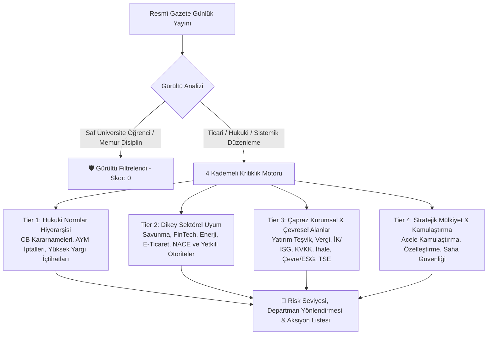
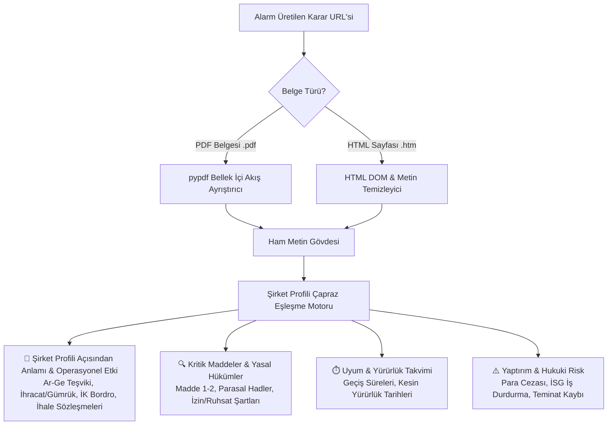

# 🏛️ Mevzuat Radarı: Çok Kademeli Denetim & Uyum Mimarisi
> **Resmî Gazete Akıllı İç Denetim, Normlar Hiyerarşisi ve Çapraz Kurumsal Risk Metodolojisi**

---

## 📌 1. Yönetici Özeti ve Temel Felsefe

Bir ticari işletmenin yasal uyum (compliance) ve iç denetim süreçleri yalnızca faaliyet gösterdiği dar sektörel tanımlardan (örneğin yalnızca *savunma*, yalnızca *bankacılık* veya yalnızca *perakende*) ibaret değildir. Her modern şirket, operasyonel varlığını sürdürebilmek için **makro hukuk sistemi, kamu teşkilatı, vergi, istihdam, veri güvenliği, kamu ihaleleri, dış ticaret, çevre ve üretim standartları** gibi çok boyutlu bir mevzuat evreninde hareket eder.

Resmî Gazete'de her gün yayımlanan kararların **%70 - %80'i** ise özel sektör şirketleri için doğrudan bağlayıcılığı olmayan *"Kamu İçi İdari İşlemlerdir"* (Üniversite öğrenci sınav yönetmelikleri, memur görevde yükselme yönergeleri, yerel zabıta tarifeleri vb.).

`Mevzuat Radarı`, klasik "anahtar kelime arama" motorlarının veya kör yapay zeka istemlerinin yarattığı iki temel kusuru ortadan kaldırmak üzere tasarlanmıştır:
1. **Yanlış Alarm Yığını (False Positives):** Şirketle ilgisi olmayan akademik/kamu içi rutinlerin bültenleri kirletmesi.
2. **Kör Nokta Riski (False Negatives):** Şirketin sektör adını doğrudan içermeyen fakat üst yönetimini, vergi yükümlülüğünü, bordrosunu, sözleşmelerini veya fabrika çevre izinlerini doğrudan etkileyen kritik kararların kaçırılması.

---

## 🏗️ 2. Dört Kademeli Regülasyon ve Kritiklik Motoru (4-Tier Architecture)

Sistem, yayımlanan her mevzuat maddesini aşağıdaki 4 kademeli hiyerarşik süzgeçten geçirerek değerlendirir:



---

### 🏛️ Tier 1: Hukuki Normlar Hiyerarşisi & Sistemik Düzenlemeler
Doğrudan devletin anayasal ve idari teşkilat yapısını değiştiren, tüm şirketleri kapsayan en üst düzey normlar:
* **Cumhurbaşkanlığı Kararnameleri (`[CB KARARNAMESİ]`):** Bakanlıkların teşkilat yapıları, idari yetkiler ve genel kamu düzenlemeleri.
* **Anayasa Mahkemesi Kararları (`[YARGI & AYM]`):** Vergi, ticaret, iş hukuku ve mülkiyet haklarına ilişkin kanun iptal kararları.
* **Yüksek Yargı İçtihadı Birleştirme Kararları (`[YARGI & İÇTİHAT]`):** Yargıtay ve Danıştay Genel Kurullarının mahkemeleri ve kamu idaresini bağlayan kesin içtihatları.

### 🛡️ Tier 2: Dikey Sektörel Uyum Katmanı (Vertical Industry Layer)
Şirketin ana faaliyet alanını, NACE kodlarını ve doğrudan lisans aldığı düzenleyici otoriteleri kapsayan öncelikli katman:
* **Savunma & Havacılık:** SSB, MSB, 5201/5202 sayılı kanunlar, askeri yasak bölgeler, taktik İHA, harp gemileri, tesis güvenlik belgesi.
* **Finans & FinTech:** BDDK, TCMB, SPK, MASAK, 6493, FAST, açık bankacılık, kripto varlıklar.
* **E-Ticaret & Perakende:** Ticaret Bakanlığı, ETBİS, 6563/6502, mesafeli sözleşmeler, Rekabet Kurumu, cayma hakkı.
* **Yazılım & Ar-Ge:** 5746/4691 Ar-Ge ve Teknokent mevzuatı, BTK, siber güvenlik, telif hakları.
* **Enerji & Altyapı:** EPDK, TEİAŞ, 6446, YEKDEM, lisanssız elektrik, GES/RES.

### 💼 Tier 3: Çapraz Kurumsal & Çevresel Katmanlar (Horizontal Corporate Domains)
Sektörden bağımsız olarak Türkiye'de faaliyet gösteren **her ticari işletmeyi** ilgilendiren yatay düzenlemeler:

| Uyum Alanı (Rozet) | Düzenleyici Otorite | Kapsanan Temel Konular | İlgili Departman |
| :--- | :--- | :--- | :--- |
| **`[VERGİ & MALİYE]`** | Hazine ve Maliye Bakanlığı, GİB | KDV, Kurumlar Vergisi, Tevkifat, E-Fatura, Enflasyon Muhasebesi, SSDF | Mali İşler & Muhasebe, Finansman |
| **`[İŞ HUKUKU & İK]`** | ÇSGB, SGK, İŞKUR | Asgari Ücret, SGK Prim Teşvikleri, 6331 İSG, Kıdem Tavanı, Uzaktan Çalışma | İnsan Kaynakları, Bordro & Özlük, İSG |
| **`[KVKK & SİBER]`** | KVKK, BTK, USOM | Yurtdışı Veri Aktarımı Standart Sözleşmeleri, VERBİS, Siber Olay Bildirimi | Hukuk & Uyum, SOC / Siber Güvenlik, IT |
| **`[KAMU İHALE]`** | Kamu İhale Kurumu (KİK), CB | 4734/4735 Fiyat Farkı Kararnameleri, İhale Eşik Değerleri, Teminat Oranları | Sözleşmeler & İhale, Tedarik Zinciri |
| **`[GÜMRÜK & DIŞ TİCARET]`** | Ticaret Bakanlığı | Gümrük Genel Tebliğleri, İthalat/İhracat Rejimi, Dahilde İşleme (DİİB), GTİP | Dış Ticaret & Lojistik, Gümrük |
| **`[YATIRIM & TEŞVİK]`** | Sanayi ve Teknoloji Bakanlığı | Yatırımlarda Devlet Yardımları, Cazibe Merkezleri, Faiz & SGK Desteği | Yatırım & Finansman, Stratejik Planlama |
| **`[ÇEVRE & SÜRDÜRÜLEBİLİRLİK]`** | Çevre Şehircilik Bakanlığı | ÇED, Çevre İzin/Lisans, Sıfır Atık, Karbon Vergisi / Emisyon Ticareti | İSG-Ç, Tesis Yönetimi & İdari İşler |
| **`[SANAYİ & STANDARTLAR]`** | Sanayi Bakanlığı, TSE, Ticaret | Sanayi Sicil Tebliğleri, TSE Standartları, CE Uygunluk Değerlendirmesi | Kalite Güvence, Üretim & Mühendislik |
| **`[TİCARET & ŞİRKETLER]`** | Ticaret Bakanlığı, SPK, Rekabet | TTK Genel Kurul, Sermaye Kaybı, Bağımsız Denetim Eşikleri, Rekabet Hukuku | Hukuk & Sözleşmeler, YK Genel Sek. |

### 📍 Tier 4: Stratejik Mülkiyet & Kamulaştırma
* **Acele Kamulaştırma & Saha Tahsisi (`[KAMULAŞTIRMA]`):** Fabrika, test sahası, boru hattı veya enerji iletim hatlarının geçtiği sahalara ilişkin mülkiyet ve kamulaştırma kararları (**Tesis Güvenlik & İdari İşler**).

---

## 🛡️ 3. Akıllı Gürültü Süzgeci ve İstisna Kapısı (Noise Filter & Override Gate)

Sistemin yanlış alarmları önlerken kritik kararları asla kaçırmamasını sağlayan 3 katmanlı filtreleme mantığı:

```text
               +-------------------------------------------+
               |         Resmî Gazete Karar Başlığı        |
               +-------------------------------------------+
                                     |
                                     v
                   +----------------------------------+
                   |  Ticari / Kanuni İstisna Var mı? |
                   |     (COMMERCIAL_OVERRIDE_TERMS)  |
                   +----------------------------------+
                         /                      \
                    EVET                         HAYIR
                    /                              \
                   v                                v
+------------------------------------+  +------------------------------------+
| ✅ İstisna Kapısı Açık:             |  | 🔍 Evrensel Gürültü Kontrolü:      |
| Karar asla filtrelenmez, doğrudan  |  | - Öğrenci/Sınav/Yaz Okulu          |
| kritiklik puanlamasına girer.      |  | - Memur Görevde Yükselme           |
|                                    |  | - Belediye Meclis Bütçesi          |
| Örnek: Üniversite TGB Alanı Kararı  |  |                                    |
+------------------------------------+  | Eşleşirse: 🛑 PUAN = 0 (GÜRÜLTÜ)   |
                                        +------------------------------------+
```

1. **Evrensel Gürültü Listesi (`UNIVERSAL_NOISE_KEYWORDS`):**
   * Üniversite içi öğrenci sınav, yaz okulu, kayıt kabul, enstitü yönergeleri; memur görevde yükselme, unvan değişikliği; yerel belediye bütçeleri ve dolmuş tarifeleri.
2. **Ticari İstisna Kapısı (`COMMERCIAL_OVERRIDE_TERMS`):**
   * Başlıkta kamu/üniversite geçse dahi karar metninde *"Teknoloji Geliştirme Bölgesi"*, *"Ar-Ge"*, *"İhale"*, *"Vergi"*, *"Asgari Ücret"*, *"Askeri Yasak Bölge"*, *"5201/5202/6493/4734"* gibi ticari bir zorunluluk geçiyorsa **istisna devreye girer ve karar korunur.**
3. **Kelimelerin Sınır Eşleşmesi (`\b` Word Boundary Regex) & Türkçe İmla Duyarlılığı:**
   * Kısa kısaltmalar (`iha`, `ssb`, `spk`, `bddk`, `ttk`, `5201`) için tam kelime sınırı kontrolü uygulanır; `tıbbi cihaz` içerisindeki `iha` gibi alt dize tuzakları engellenir.
   * `I/ı` ve `İ/i` dönüşümleri özel `lower_tr()` motoru ile hatasız işletilir.

---

## 📋 4. Departman Yönlendirmesi ve Dinamik Aksiyon Listeleri

Tespit edilen her mevzuat maddesi için sistem otomatik olarak:
1. **Etkilenen Departmanları** belirler (Örn: `Mali İşler`, `İnsan Kaynakları`, `Hukuk & Uyum`, `Sözleşmeler & İhale`, `İSG-Ç`, `Kalite Güvence`).
2. **Yaptırım & Hukuki Riski** tanımlar (Vergi ziyaı cezası, İSG iş durdurma, KVKK 1M+ TL idari para cezası, kamu ihalelerinden yasaklanma vb.).
3. **İç Denetim Aksiyon Kontrol Listesi (Checklist)** üretir:
   * *Vergi için:* ERP/muhasebe parametrelerinin güncellenmesi, YMM tevsik kontrolleri.
   * *İK için:* Bordro parametreleri, uzaktan çalışma prosedürü, İSG risk analizi.
   * *KVKK için:* VERBİS envanter teyidi, standart sözleşme revizyonu.
   * *İhale için:* Fiyat farkı katsayı analizi, yerli katkı şartnameleri.

---

## ⚡ 5. Hazır Sektörel Uyum Şablonları (One-Click Presets)

Web arayüzündeki **"Şirket Profili & Sektörel Şablonlar"** sekmesinden tek tıkla yüklenebilen standart sektör kalibrasyonları:
* 🛡️ **Savunma Sanayii, Havacılık & Askeri Sistemler** (SSB, MSB, 5201/5202, İHA, Askeri İhracat)
* 💳 **Finans, Bankacılık & FinTech** (BDDK, TCMB, SPK, MASAK, 6493, FAST, Kripto)
* 🛒 **E-Ticaret & Pazaryeri** (Ticaret Bakanlığı, ETBİS, 6563/6502, Rekabet Kurumu, Cayma Hakkı)
* 💻 **Yazılım, SaaS & Ar-Ge** (Sanayi Teknoloji, BTK, 5746/4691, KVKK, Telif)
* ⚡ **Enerji & Elektrik Piyasası** (EPDK, TEİAŞ, 6446, YEKDEM, GES/RES)

---

## 🤖 6. Hibrit Motor: Kural Tabanlı Hız + Yapay Zeka Derinliği

* **Varsayılan Mod (Deterministic Rule-Based):** Dış API bağımlılığı olmadan, 0 ms gecikmeyle ve sıfır maliyetle çalışır.
* **Yapay Zeka Modu (LLM Engine):** OpenAI (GPT-4o), Anthropic (Claude 3.5 Sonnet), Google Gemini veya Yerel LLM (Ollama/DeepSeek) bağlandığında metinlerin derin hukuki semantik analizini yaparak bülteni zenginleştirir.
* **MCP Sunucu Desteği:** `src/server.py` üzerinden Cursor, Claude Desktop ve Antigravity IDE'ye doğrudan bağlanarak bir iç denetim ajanı olarak görev yapar.

---

## 🔬 7. Derin Karar İçeriği & Şirket Profili Semantik Etki Analizi

Sistem, alarmları yalnızca karar başlıklarına bakarak üretmekle yetinmez; arka planda kararın **tam metin gövdesini (HTML ve PDF akışları)** doğrudan okuyarak şirket profiliyle çapraz etki analizine tabi tutar:



### 🧠 7.1. Şirket Profili Açısından Anlamı (`company_specific_impact`)
Metindeki hükümler, şirketin YAML konfigürasyonundaki operasyonel özellikleriyle eşleştirilir:
* **Savunma & Askeri Sistemler:** Taktik İHA (KARGU/ALPAGU) ve askeri denizcilik (MİLGEM) projeleri için saha test izinleri, tesis güvenlik belgesi (5201/5202) ve SSB/MSB onay süreçlerine etkisi.
* **Vergi & Mali İşler:** Şirketin ölçeği ve cirosu çerçevesinde ERP faturalama, tevkifat oranları, 5746 Ar-Ge teşvikleri ve SSDF fon kesintileri yükümlülükleri.
* **İş Hukuku & İK:** Şirketin çalışan sayısı ve mühendislik kadrosu için asgari ücret/tavan, SGK teşvikleri ve 6331 İSG risk analizi.
* **KVKK & Bilgi Güvenliği:** İşlenen paydaş verileri ve USOM/BTK siber olay bildirim yükümlülükleri.
* **Kamu İhaleleri:** 4734/4735 kapsamındaki sözleşmelerde fiyat farkı formülleri ve teminat oranları.
* **Gümrük & Dış Ticaret:** GTİP tarife pozisyonları, Dahilde İşleme İzin Belgeleri (DİİB) ve kambiyo süreleri.

### 🔍 7.2. Kritik Maddeler & Hüküm Çıkarımı (`key_articles_summary`)
* Metindeki `MADDE 1 (Amaç)`, `MADDE 2 (Kapsam)`, `Dayanak`, parasal hadler, başvuru süreleri ve istisnalar otomatik ayıklanır.

### ⏱️ 7.3. Uyum & Yürürlük Takvimi (`compliance_deadlines`)
* Düzenlemenin yürürlüğe giriş tarihi, geçiş süreleri (Örn: *"Yayımı tarihinden itibaren 3 ay sonra"*, *"1/1/2026 tarihinden geçerli olmak üzere"*) metin içinden regex ve semantik kalıplarla tespit edilir.

