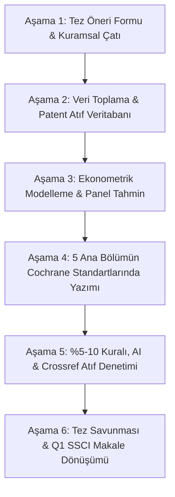

# YÜKSEK LİSANS TEZİ UYGULAMA PLANI VE YOL HARİTASI

**Tez Başlığı:** *Savunma Sanayii Ar-Ge Harcamalarının Sivil Sektörlerdeki Patent Kalitesine Yayılma Etkisi (Spillover): Patent Atıf Ağlarıyla Ampirik Bir İnceleme*  
**Araştırmacı & Ajan:** Yüksek Lisans Adayı & `econ_thesis_agent`

---

## 📅 6 Aşamalı Uçtan Uca Yol Haritası

### 1. AŞAMA (1. - 2. Ay): Araştırma Tasarımı & Tez Öneri Formu
*   **Amaç:** Danışman ve enstitü onayından tek seferde geçecek resmi Tez Öneri Formu'nu (*Research Proposal*) tamamlamak.
*   **Görev Dağılımı:**
    *   *econ_thesis_agent:* 3 somut katkı (*contribution*), araştırma soruları ve $H_1$, $H_2$ hipotezlerini formüle eder.
    *   *Araştırmacı:* Danışman ile görüşüp enstitü şablonuna göre onay sürecini başlatır.

### 2. AŞAMA (3. - 4. Ay): Veri Mimarisi ve Patent Atıf Ağı
*   **Amaç:** %100 açık kaynaklı mikro panel veri setini inşa etmek.
*   **Görev Dağılımı:**
    *   *Python Scriptleri (`tools/fetch_patent_data.py`):* Türk Patent ve Google Patents üzerinden ASELSAN, TUSAŞ, ROKETSAN, BAYKAR, HAVELSAN ve STM'nin 2005-2024 arası tüm tescilli patentlerini (yaklaşık 1.500 patent) çeker.
    *   *Atıf Ağı (Forward Citations):* Bu patentlere atıf yapan sivil Türk firmalarını (Arçelik, Vestel, Ford Otosan, Turkcell vb.) tespit eder.
    *   *SASAD & TÜİK:* Sektörel Ar-Ge ve mühendis istihdamı panel serisini entegre eder.

### 3. AŞAMA (5. - 6. Ay): Ekonometrik Modelleme & Analiz
*   **Amaç:** Stata / R / Python ortamında nedensel modelleri tahmin etmek.
*   **Görev Dağılımı:**
    *   *Jaffe (1986) Teknoloji Yakınlık Matrisi:* Savunma ve sivil IPC sınıfları arasındaki mesafeyi ($\omega_{ij}$) hesaplar.
    *   *Sabit Etkili Panel Negatif Binom / PQML Modelleri:*
        $$\mathbb{E}[\text{CivilCitations}_{ist} \mid X] = \exp\left( \beta_1 \ln(\text{DefR\&D}_{t-k}) + \beta_2 \text{TechProximity}_{is} + \mathbf{X}_{ist}'\boldsymbol{\gamma} + \alpha_i + \lambda_t \right)$$
    *   *Sağlamlık (Robustness) Testleri:* Alternatif gecikmeler ve sahte şok (placebo) testleri.

### 4. AŞAMA (7. - 9. Ay): Bölüm Bölüm Tez Yazımı
*   **Amaç:** Cochrane & McCloskey kurallarına tam uyumlu 5 bölümün yazımı.
    *   *Bölüm 1 (Giriş):* Kanca, araştırma sorusu, ampirik sonuçların özeti, 3 katkı.
    *   *Bölüm 2 (Literatür):* Jaffe, Moretti, Griliches sentezi.
    *   *Bölüm 3 (Metodoloji):* Çift kullanımlı teknoloji teorisi ve panel sayma modelleri (\LaTeX).
    *   *Bölüm 4 (Bulgular):* Regresyon tabloları (Stargazer/Esttab) ve marjinal etkiler.
    *   *Bölüm 5 (Sonuç & Politika):* SSB ve Sanayi Bakanlığı için somut reçeteler.

### 5. AŞAMA (10. Ay): Akademik Dürüstlük & Kalite Denetimi
*   **Amaç:** Sıfır intihal, sıfır sahte atıf ve sıfır AI tespit riski.
    *   `tools/verify_citations.py` ile tüm kaynakça Crossref API üzerinden taranır.
    *   `tools/check_ai_patterns.py` ile doğrudan alıntı oranı < %5 ve cümle ritmi (*burstiness*) insan yazarı düzeyinde tutulur.

### 6. AŞAMA (11. - 12. Ay): Savunma & Q1 SSCI Makale Çıkarımı
*   **Amaç:** Başarılı tez savunması ve *Defence and Peace Economics* dergisine makale gönderimi.
